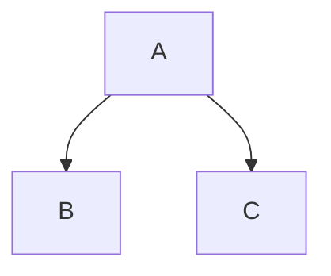

大体思路就是，工程里加一个类，加一个cpp文件一个h文件，
```mermaid
JsonClass : Struct JsonStruct
JSonClass : void ReadJson() 
JSonClass : void SaveJson() 
JSonClass : JsonStruct GetJson() 
JSonClass : int getA()
JSonClass : int getB()
Class01 <|-- JSonClass : Cool
```

```mermaid

Class01 <|-- AveryLongClass : Cool
Class03 *-- Class04
Class05 o-- Class06
Class07 .. Class08
Class09 --> C2 : Where am i?
Class09 --* C3
Class09 --|> Class07
Class07 : equals()
Class07 : Object[] elementData
Class01 : size()
Class01 : int chimp
Class01 : int gorilla
Class08 <--> C2: Cool label
```
