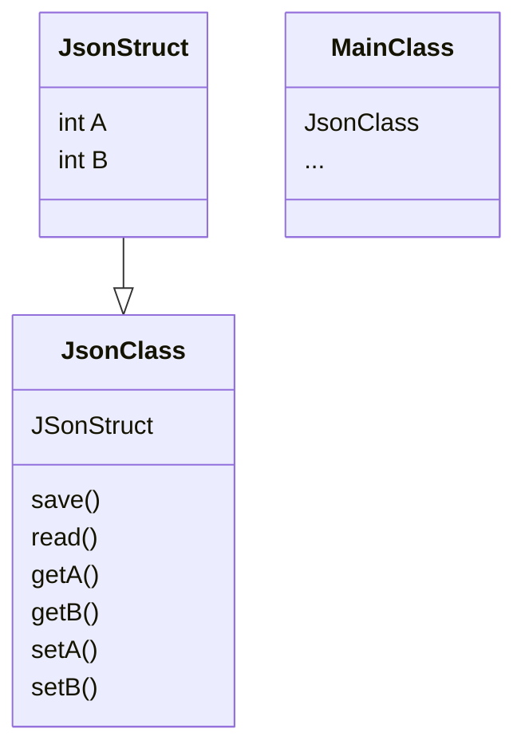

大体思路就是，工程里加一个类，加一个cpp文件一个h文件，这个类包装一个包含了配置内容的结构体，然后有读json文件的函数，有写json文件的函数，还有提取某个key-value的方法，json文件内容是可变的，比较灵活，易于扩展。




json文件定义：
```json
{
    "version":1001,
    "controller":[{
        "box":{
            "carRear" : true,
            "carSide" : true,
            "3DBox":true,
            "Pedestrian":true,
            "Cyclist":true,
            "TrafficLight":true,
            "TrafficSign":true
        },
        "line":{
            "Lane":true,
            "RodeEdge":true,
            "stopLine":true,
            "freeSpace":true
        },
        "3Dview":{
            "EQ4":true,
            "PNC":true,
            "frontRadar":true,
            "cornerRadar":true
        }
    }
]
}
```